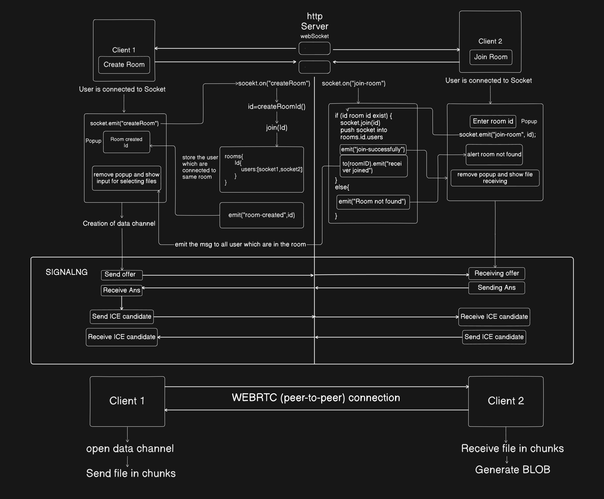

# ShareEzy

A real-time peer-to-peer file sharing web application built using **WebRTC**, **Socket.io**, **React**, and **Node.js**.

Share files directly between devices without uploading them to a central server.

---

# Features

* ⚡ Real-time file transfer
* 🔗 Peer-to-peer communication using WebRTC
* 📂 Multiple file sharing
* 📶 Live connection establishment
* 📊 File receiving progress bar
* 🔒 Encrypted WebRTC DataChannel transfer
* 🌍 Cross-device sharing
* 📱 Mobile support
* 🧩 Chunked file transfer for large files
* 🔄 ICE candidate exchange using Socket.io signaling

---

# 🛠️ Tech Stack

## Frontend

* React
* Tailwind CSS
* Socket.io Client

## Backend

* Node.js
* Express.js
* Socket.io

## Networking / Realtime

* WebRTC
* STUN / TURN Servers
* RTCDataChannel

## Deployment

* Vercel (Frontend)
* Render (Backend)

---

# 🧠 How It Works

1. User creates or joins a room.
2. Socket.io handles signaling between peers.
3. WebRTC establishes direct peer-to-peer connection.
4. ICE candidates are exchanged to discover network routes.
5. RTCDataChannel is opened between peers.
6. Files are converted into binary data using `ArrayBuffer`.
7. Files are split into chunks and transferred.
8. Receiver reconstructs chunks into original file using `Blob`.

---

# 🧱 Architecture



---

# 🔄 WebRTC Connection Flow

```text
Create RTCPeerConnection
↓
Create DataChannel
↓
Create Offer
↓
Set Local Description
↓
Send Offer
↓
Receive Offer
↓
Create Answer
↓
Set Remote Description
↓
ICE Candidate Exchange
↓
Connection Established
↓
DataChannel Open
↓
File Transfer Starts
```

---

# 📦 Project Structure

```text
project-root/
│
├── frontend/
│   ├── src/
│   ├── public/
│   └── package.json
│
├── backend/
│   ├── index.js
│   └── package.json
│
└── README.md
```

---

# ⚙️ Installation

## Clone Repository

```bash
git clone https://github.com/tanmay-mangale/shareEzy.git
```

---

# Frontend Setup

```bash
cd frontend
npm install
npm run dev
```

---

# Backend Setup

```bash
cd backend
npm install
node index.js
```

---

# 🌐 Deployment

## Frontend

Deploy on Vercel.

## Backend

Deploy on Render.

---

# 🙌 Learning Outcomes

This project helped in understanding:

* WebRTC internals
* ICE Candidate exchange
* RTCDataChannel
* Peer-to-peer networking
* Chunked binary transfer
* Socket.io signaling
* Real-time systems
* Browser networking APIs

---

# Live Demo

Click here: https://shareezy.vercel.app/